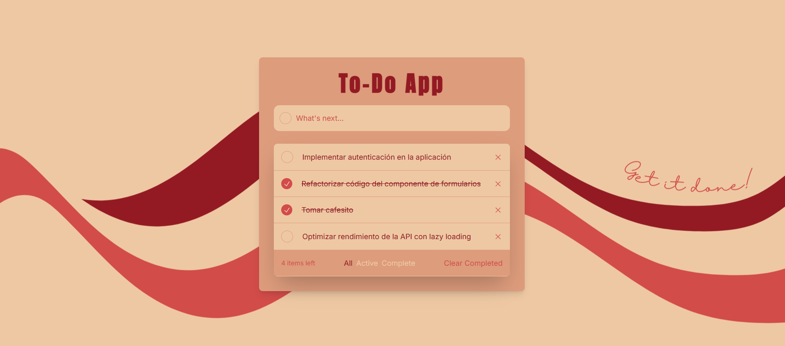
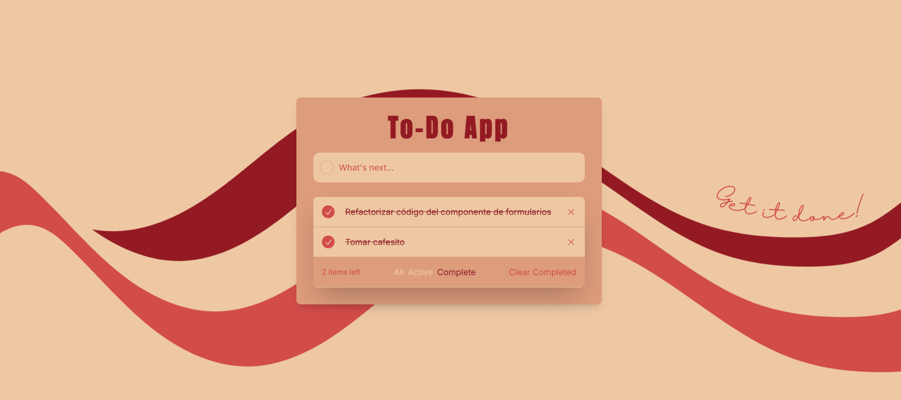

# TodoApp - Aplicación de Gestión de Tareas

**TodoApp** es una aplicación de organización de tareas que te permite clasificar y gestionar tus tareas de manera eficiente. Desarrollada con **React** y **Tailwind CSS**, esta aplicación te ofrece una interfaz limpia y moderna para mantenerte al tanto de todas tus tareas. Puedes clasificar tus tareas en tres categorías: **Todas**, **Completadas** y **Activas**, para tener una visión clara de tu progreso.

## 🚀 Descripción del Producto

### ¿Cómo funciona TodoApp?

La aplicación está diseñada para facilitar la gestión de tareas. Al abrir **TodoApp**, podrás agregar nuevas tareas y asignarlas a una de las tres categorías:

- **Todas**: Ver todas las tareas, tanto activas como completadas.
- **Completadas**: Ver solo las tareas que has marcado como completadas.
- **Activas**: Ver solo las tareas que aún están pendientes de completarse.

### 1. **Pantalla de Todas las Tareas**

En la vista de **Todas**, podrás ver una lista de todas las tareas, sin importar su estado. Aquí se incluyen tanto las tareas activas como las completadas.

### 2. **Pantalla de Tareas Activas**

La vista de **Activas** muestra solo las tareas que aún están en proceso y que no han sido marcadas como completadas. Aquí podrás administrar las tareas que necesitas realizar.

### 3. **Pantalla de Tareas Completadas**

En la sección **Completadas**, podrás ver todas las tareas que ya has terminado. Esto te permitirá llevar un seguimiento de tu progreso y mantenerte organizado.

## 🛠 Tecnologías Utilizadas

- **Frontend**: [React](https://reactjs.org) + [Tailwind CSS](https://tailwindcss.com) para la construcción de una interfaz moderna y responsiva.
- **Gestión de Estado**: Utiliza el estado local de React para gestionar las tareas y su clasificación.
- **Estilos**: Tailwind CSS proporciona una forma rápida y flexible de diseñar la interfaz de usuario.
